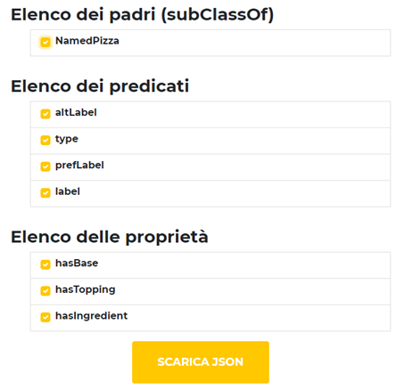
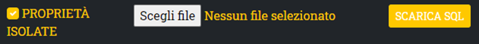

# Ontology Interrogation

## Introduzione
Il progetto oggetto di questa relazione ha lo scopo di permettere la navigazione all’interno di un’ontologia e la creazione di file JSON ed SQL a partire dai dati navigati. 

Per ogni entità ricercata, l’interfaccia grafica messa a disposizione mostrerà il Padre, i predicati e le proprietà dell’entità.

Selezionando le proprietà/predicati e cliccando Scarica JSON, è possibile generare file JSON contenente i valori relativi a predicati e proprietà selezionati per ogni entità figlia dello stesso padre dell’entità cercata.

Un file JSON prodotto in questo modo può essere convertito in un file SQL per la creazione e il popolamento di tabelle.

## Struttura del progetto


Il progetto è suddiviso in 3 microservizi, ognuno con una funzione precisa:
-	Ont_interrogation: permette di interrogare un file .owl relativo ad un’ontologia.
     Fornisce API per ottenere predicati entranti e uscenti, soggetti e oggetti, proprietà e relativi valori;
-   Tree_view: permette di generare un file .json a partire da un’interrogazione fornita dal microservizio Ont_interrogation. 
    Fornisce una schermata per la selezione di un sottoinsieme dei campi che devono far parte del file .json. 
-   SQL_Maker: a partire da un file JSON, genera un file .sql contenente le query di creazione delle tabelle ed inserimento delle entry.

I microservizi descritti sopra si trovano rispettivamente nelle cartelle first_micro, second_micro e third_micro. La cartella examples contiene alcuni file demo ottenuti dall'esecuzione del progetto.
## Configurazione del progetto

Per il corretto funzionamento del progetto, è necesserio effettuare l’upload del file .owl all’interno del primo microservizio (ont_interrogation).

Per la configurazione del microservizio ONT_INTERROGATION sono utilizzate le seguenti variabili di ambiente:

| Variabile          | Descrizione                                                  |
| ------------------ | ------------------------------------------------------------ |
| `ONTOLOGY_PREFIX`  | prefisso relativo alle entità utilizzato all’interno dell’ontologia |
| `OWL_FILE_NAME`    | percorso + nome del file .owl |


Per la configurazione del microservizio TREE_VIEW sono utilizzate le seguenti variabili di ambiente:


| Variabile          | Descrizione                                                  |
| ------------------ | ------------------------------------------------------------ |
| `ONT_INTERROGATION_API_URL`  | endpoint delle API del microservizio ONT_INTERROGATION |
| `SQL_MAKER_API_URL`    | endpoint delle API del microservizio SQL_MAKER |


## Avvio con Docker

È possibile eseguire l'applicazione con Docker; allo scopo sono stati preparati tre `Dockerfile` basati sull'immagine python:3.8 ed un `docker-compose`. 


Dalla directory principale del progetto lanciare il comando:

```bash
docker-compose up --build
```

### Utilizzo dell'immagini Docker
 
Non appena il comando descritto sopra ha completato la sua esecuzione, sarà possibile raggiungere tramite browser l'interfaccia grafica (cuore del progetto)
all'indirizzo `127.0.0.1:8002`.

Per quanto riguarda i microservizi ONT_INTERROGATION e SQL_MAKER saranno avviati rispettivamente sulle porte 8001 e 8003.


## Utilizzo dell'applicativo

### Ricerca di un'entità

Per navigare l'ontologia e visualizzare predicati/proprietà relativi ad un'entità, basterà digitare nell'apposito campo il nome dell'entità. (nell'esempio proprosto è stata cercata l'entità "Margherita").


Il risultato della ricerca è quello mostrato nella figura sottostante.



Dopo aver selezionato i predicati e le proprietà desiderate, sarà possibile generare un JSON contenente i dati selezionati relativamente alle entità figlie del padre dell'entità cercata.

Il JSON così generato potrà essere inserito all'interno del campo mostrato nell'immagine sotto per generare un file .sql.



Se la casella Proprietà Isolate non è spuntata:
-   Viene creata un’unica tabella avente una colonna per ogni campo selezionato precedentemente.
-   In caso di proprietà con più valori, sono inserite all’interno della stessa colonna, separate da una virgola. 

Se la casella Proprietà Isolate è spuntata:
-   Viene creata una tabella principale, una tabella per ogni proprietà e delle tabelle di relazione (relazione tra tabella principale e ogni proprietà);
    -	La tabella di ogni proprietà conterrà una entry per ogni valore presente.
    -   Le tabelle delle relazioni associano una entry della tabella principale con una o più entry della tabella delle proprietà.